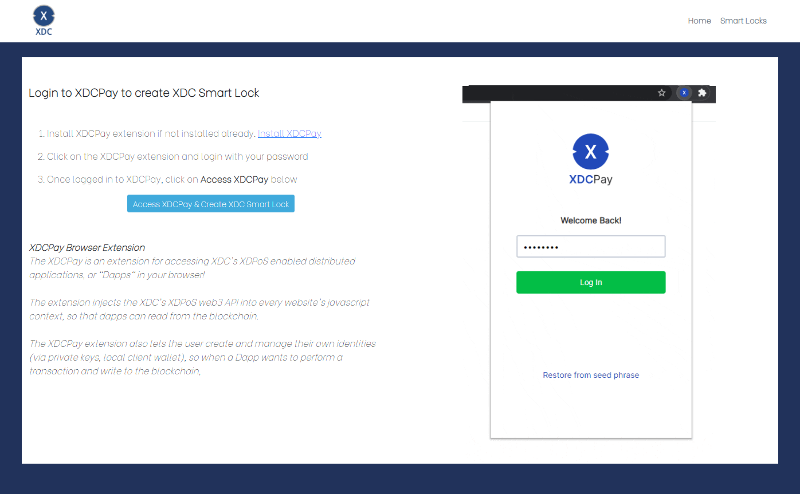
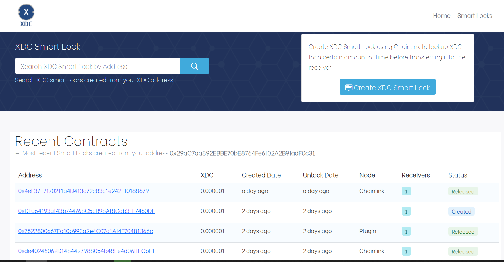
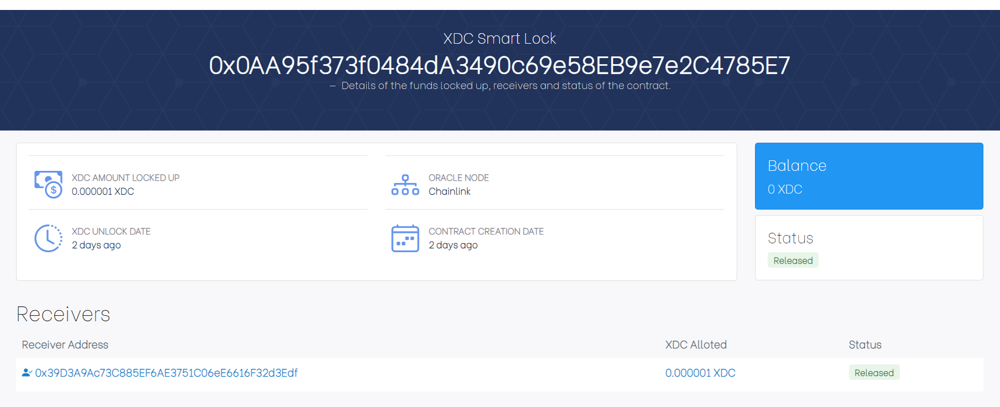
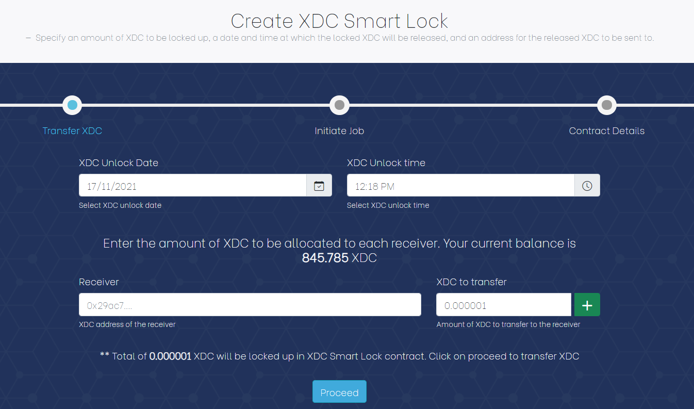

[](https://xinfin.org/)

# XDC Smart Lock
---
Create XDC Smart Lock where the time can be sourced from multiple oracle nodes. A funder would specify an amount of XDC to be locked up, a date and time at which the locked XDC will be released, and an address for the released XDC to be sent to. 

# Table of contents
---
   * [Overview](#overview)
   * [Prerequisite](#prerequisite)
   * [Tools & Technologies](#tools--technologies)
   * [Configuring Chainlink Job](#configuring-chainlink-job)
   * [Configuring Plugin Job](#configuring-plugin-job)
   * [Contract & Designs](#contracts--designs)
   * [Deploying Contracts](#deploying-contracts)
   * [Configuring the Application](#configuring-the-application)
   * [Building the Application](#building-the-application)
      * [Using npm](#using-npm)
      * [Using Docker](#using-docker)
   * [Accessing the Application](#accessing-the-application)
      * [Login](#login)
      * [Faucet](#faucet)
      * [Contracts](#contracts)
      * [New Contract](#new-contract) 
      
## Overview
---
XDC Smart Lock is a feature which allows users to send XDC payments to multiple rceivers. These conditional payments, sets the XDC aside and transfers it to receivers when the time is elapsed. 
After the expiration time, only the intended receivers can get the locked up XDC.


## Prerequisite
---
This application requires integration of [XinFin](https://xinfin.org/) Network with [Chainlink](https://chain.link/) and [Go Plugin](https://goplugin.co/). 

It is recommended to follow 

1. [XinFin-Chainlink](https://github.com/XinFinOrg/XinFin-ChainLink) guide and setup all the required applications which includes -   

- Chainlink node
- Chainlink - External Initiator
- Deploying LINK token contract 
- Deploying Chainlink Oracle contract

2. [XinFin-Plugin](https://github.com/GoPlugin/Xinfin-Plugin) guide and setup all the required applications which includes -   

- Plugin node
- Plugin - External Initiator
- Deploying PLI token contract 
- Deploying PLI Oracle contract

## Tools & Technologies
---

Following tools and technologies have been usse to develop XDC Smart Lock application -

- Node.js v12.8 - https://nodejs.org/en/
- Vue.js v4.x - https://v3.vuejs.org/
- Bootstrap v5.x - https://getbootstrap.com/
- web3 / xdc3 v1.3.x - https://web3js.readthedocs.io/en/v1.5.2/
- XDCPay v6.2.4 - https://chrome.google.com/webstore/detail/xdcpay/bocpokimicclpaiekenaeelehdjllofo?hl=en
- Chainlink v0.10.x - https://chain.link/
- Go Plugin v0.0.3 - https://goplugin.co/
- Solidity v0.4.24 - https://docs.soliditylang.org/en/v0.8.7/


## Configuring Chainlink Job
---

Create an [Alarm Job](https://docs.chain.link/docs/chainlink-alarm-clock/) in Chainlink node. Steps to create Alarm Job -

- Login to Chainlink node
- Navgate to **Jobs** and click on **New Job**
- Copy the job specification form **jobs/chainlink/alarm-job.json** file
- Paste the contents into the **Json Spec** field and create the job 
- Copy the newly created job id which we will be using later

## Configuring Plugin Job
---

Create an [Alarm Job] in Plugin node. Steps to create Alarm Job -

- Login to Plugin node
- Navgate to **Jobs** and click on **New Job**
- Copy the job specification form **jobs/goplugin/alarm-job.json** file
- Paste the contents into the **Json Spec** field and create the job 
- Copy the newly created job id which we will be using later

## Contracts & Designs
---


Details of various contracts created for XDC SmartLock application - 

- **XDCSmartLockConfig**
  - Stores configurations related to different node types i.e. for **Chainlink** and **Plugin**
  - Following information is stored for each node type
    - Token address
    - Oracle address
    - Job Id
    - Fatory contract address
- **XDCSmartLockStore**
  - Store contract is use to store the SmartLock contract addresses againt the funder/user.
  - Store the **XDCSmartLockConfig** address
- **XDCSmartLockFactory**
  - Contract responsible for creating new instances of XDCSmartLock 
  - Stores the contract details in XDCSmartLock Store which includes
    - Address of the new smartlock against the funder
    - Contract Summart i.e. contract status, created date, unlock date 
- **XDCSmartLock**
  - Base / Abstract contract to handle all the XDCSmartLock core logic. 
  - Create XDC Smart Lock where the time is sourced from a either a Chainlink or Go Plugin oracle. 
  - Funder would specify an amount of XDC to be locked up, a date and time at which the locked XDC will be released and an address for the released XDC to be sent to
- **ChanlinkSmartLockClient**
  - Responsible for creation of Alarm Job in Chainlink node
- **PluginSmartLockClient**
  - Responsible for creation of Alarm Job in Plugin node


## Deploying Contracts
---

Compile and deploy the contracts required for XDC Smart Lock creation using [remix](https://remix.xinfin.network/) editor.

- **Deploying XDCSmartLockFactory**
  - Compile & Deploy **contracts/smartlock/XDCSmartLockFactory.sol** 
  - Copy the XDCSmartLockFactory address which will be used later in XDCSmartLockConfig

- **Deploying ChainlinkSmartLockFactory**
  - Compile & Deploy **contracts/chainlink/ChainlinkSmartLockFactory.sol** 
  - Copy the ChainlinkSmartLockFactory address which will be used later in XDCSmartLockConfig

- **Deploying PluginSmartLockFactory**
  - Compile & Deploy **contracts/chainlink/PluginSmartLockFactory.sol** 
  - Copy the PluginSmartLockFactory address which will be used later in XDCSmartLockConfig

- **Deploying XDCSmartLockConfig**
  - Compile and deploy **contracts/store/XDCSmartLockConfig.sol** 
  - Compile **contracts/store/XDCSmartLockConfigProxy.sol** 
    - This contract inherits the OpenZeppelin Proxy to maintain the contract state in event of upgrades
    - Deploy the contract using the **XDCSmartLockConfig** address as a constructor parameter
  - Set the appropriate configuration settings for Chainlink and Plugin nodes-
    - Invoke **setConfig** method with appropriate configuration parameters, Syntax <NodeType, Token Addres, Oracle Contract Addr, Job Id, Plugin or Chainlink Factory Contract Address, Fee>
    - Invoke **setConfig** method with Chainlink configurations Eg: 
    "Chainlink",0x499F9320079C3a5Dd30AF691ea1a88e8c75FDA17,0x84F64C5AC6eBB7B2caaAA479050139650b922453,"b166b3027fd742e6be9fe203fb58f571",0xDEa3eCcfCB746A1a3EBa63865ad27872A2a5EE4a,100000000000000000
    - Invoke **setConfig** method with Plugin configurations Eg: 
    "Plugin",0x4068b305f897CFb06baEF17673af8f04D008EF12,0xb9e8572e251083f5D94B5366C37F81A6Ca462F6A,"a781b7cbe6734f42af8cb01ef20c086c",0xd3d22e9dA8ED7398631446e5Ae87D6B286Fa374f,100000000000000000
  - Set XDCSmartLockFactory contract address by calling **setSmartLockFactoryAddress** method  
  - Copy the XDCSmartLockConfigProxy address which will be used later in XDCSmartLockStore

- **Deploying XDCSmartLockStore**
  - Compile and deploy **contracts/store/XDCSmartLockStore.sol** 
  - Compile **contracts/store/XDCSmartLockStoreProxy.sol** 
    - This contract inherits the OpenZeppelin Proxy to maintain the contract state in event of upgrades
    - Deploy the contract using the **XDCSmartLockStore** address as a constructor parameter
  - Set XDCSmartLockConfigProxy contract address by calling **setSmartLockConfigAddr** method 
  - Copy the XDCSmartLockStoreProxy address which will be used later in the UI   


After deploying all the contracts we finally should have the address of **XDCSmartLockStoreProxy** contract which will be used in the UI. 

| Keyword | Description |
| ------ | ------ |
| **SMARTLOCK_STORE_ADDR** | Address of the deployed XDCSmartLockStoreProxy contract |


## Configuring the Application
---

Before building or running the application following fields values should be replaced in **ui/src/assets/js/config.js**.

**NOTE**: Network id **51** refers to XinFin Apothem network and **50** refers to XinFin Main network

- SMARTLOCK_STORE_ADDR

## Building The Application
---

### Using npm 

- For local development, run the below command from project root directory and access the application using http://localhost:3000 
    ```sh
    npm install
    npm run serve -- --port 3000
    ```

- For production environments, run the below command and once the build is successful final artifacts should be available in **dist/** directory
    ```sh
    npm run build
    ```

### Using Docker

```sh
docker build -t xdc-smartlock .
docker run -p 8080:8080 xdc-smartlock
```

## Accessing the Application
---

### Login
---
- An account in [XDCPay](https://chrome.google.com/webstore/detail/xdcpay/bocpokimicclpaiekenaeelehdjllofo?hl=en) is required to access the application. Users will approve the transaction using XDCPay.  
- Make sure the address added in XDCPay has sufficient XDC based on the network being used.
- Add the Link token address in XDCPay wallet and make sure there is sufficient LINK balance.



### Faucet
---
Acquire Apothem (testnet) LINK and PLI tokens. Select the required token type and click on proceed to get the tokens to test in Apothem network.


### Smart Locks
---
Displays the list of Smart Lock contracts created by the user with following information -

| Field | Description |
| ------ | ------ |
| Contract Address | Address of the XDC Smart Lock  |
| XDC | Total amount of XDC locked up |
| Created Date | Contract creation date |
| Unlock Date | XDC release date |
| Node | Node type either Chainlink or Plugin |
| Receivers | Total number of receivers and corresponding XDC locked up |
| Status | Status of the transaction |





### Smart Lock Details
---

Displays the XDC Smart Lock details which includes -

- Contract Address
- Total XDC locked up
- Status of the contract
- Current balance of the contract
- Receivers and corresponding funds allocated
- Created Date
- Unlock Date
- Oracle node selected to initiate the Alarm job i.e. either **Chainlink** or **Plugin**



Based on the status of the contract, following actions will be provided -

| Action | Description |
| ------ | ------ |
| **Transfer Token** | This option will be available only if LINK token is not transferred to the contract. Using this option LINK token can be transferred to the contract to initiate the Chainlink job  |
| **Withdraw Contract** | This option will be available only if LINK token is not transferred and when contract is not initiated. Using this option user can withdraw the total allocated XDC back to wallet|


### New Smart Lock
---
Creating XDC Smart Lock is a 2 step process, which includes - 

- Creating a new Contract 
- Choosing the appropriate oracle node and transfer the tokens required to initiate the Alarm Job

##### Creating a new Contract 

- User specifies the duration of XDC lockup
- Amount of XDC to be allocated to each receiver

On contract creation, XDC will be transferred from user's wallet to the new contract.



##### Choosing the appropriate oracle node to initiate Alarm Job 

In this step, either **Chainlink** or **Plugin** nodes can be selected to initiate the Alarm job.

- Chainlink: LINK token will be transferred to the created contract. Link fee is required to initiate the job in Chainlink node.
- Plugin: PLI token will be transferred to the created contract. PLI fee is required to initiate the job in Plugin node.

